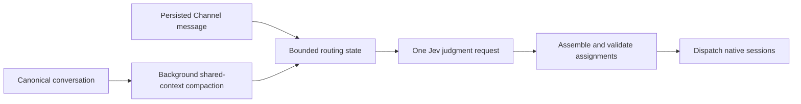

# Jev routing speed research

Status: research reviewed 2026-09-17; the opt-in adapter, local retrieval, original-message participant delivery, and background compaction are implemented. Live synthetic smoke checks passed on the same date; see the measurements below. The [Product specification](product-spec.md#65-commonspace-inference-routing-and-correction) owns supported behavior. Production quality, calibrated thresholds, and message-to-dispatch p95 remain unverified. Recommendations below retain the broader evaluation proposal; per-judgment receipts remain future work.

## Recommendation

Evaluate Jev as the source of routing judgments: owner selection, independent responsibility, delivery mode, and Project relevance. Commonspace assembles and validates assignments from those judgments. Retain text generation for shared-context compaction. Selected Agents receive the original user message unchanged; routing does not author or extract sub-requests.

The implemented slice uses one Jev request and no text-generation call before dispatch for single, parallel, and relay delivery. Multi-agent participation and relay ordering still need broader quality evaluation. Adding Jev only as a reviewer would leave a routing generation call on the critical path.

## What Jev can do

Jev is TypeSafe's System One model for typed decisions over application state. It accepts text and JSON state, including conversation messages, candidate descriptions, and policies. It does not generate replies, code, new summaries, or reasoning explanations. See [System One](https://docs.typesafe.ai/concepts/system-one.md) and [State](https://docs.typesafe.ai/concepts/state.md).

| Capability | Result | Commonspace use |
| --- | --- | --- |
| Choice | One supplied option, its distribution, and confidence | Choose one eligible owner, or an unresolved outcome; select a known delivery strategy |
| Noul | Probability that a stated condition holds; no separate confidence | Determine whether an Agent has independently necessary work or a Project is relevant |
| Score | Probability-weighted position on described ordered levels, distribution, and confidence | Rank relevance or suitability when several acceptable choices exist |
| Closed-set argument selection | Values from enumerated options | Fill known Agent IDs, Project IDs, and routing roles |
| Source-value selection | One supplied candidate span | Select already identified request passages; code copies their text |

Choice supports up to 255 options, including any unresolved option. A Choice distribution represents competing alternatives; it is not a multi-agent participation distribution. Multiple independently applicable responsibilities need separate judgments. Sources: [Choice](https://docs.typesafe.ai/primitives/choice.md), [HTTP API](https://docs.typesafe.ai/api.md), [function calling](https://docs.typesafe.ai/cookbooks/function_calling.md), and [pre-parsed extraction](https://docs.typesafe.ai/cookbooks/pre_parsed_value_extraction_cookbook.md).

Independent questions can share one state and run in parallel in one request. They cannot consume one another's answers. Ask speculative branch-specific questions explicitly, then let code consume only applicable answers. A second request is needed if an earlier result determines new evidence or options. Additional questions still consume input tokens and response bytes. See [speculative fan-out](https://docs.typesafe.ai/patterns/fan-out.md).

## Current limits and failure modes

The current [model page](https://docs.typesafe.ai/models.md) lists `jev-1.13.0`; `jev-latest` and `jev-preview` currently resolve to that version. Pin the version during evaluation and store the returned model ID. Alias changes can alter judgments without a code change.

The [Jev 1.13 limitations](https://docs.typesafe.ai/model-jaggedness/jev-1.13.md), reviewed by TypeSafe on 2026-09-16, are directly relevant to routing:

- Maximum context is 64k tokens across all state and questions, and 32k for state plus the longest question. These are service limits, not recommended routing budgets.
- Irrelevant state harms accuracy. A full transcript is a poor substitute for relevant summaries and recent evidence.
- Literal reading, negations, and several levels of indirection can cause errors. Describe responsibility boundaries and reference specific state fields directly.
- Counting, arithmetic, numeric precision, and date comparison belong in code.
- Adversarial text in state can influence the result. Explicit mentions, membership, limits, and Project restrictions remain enforced by code.
- Generation through chained Choices is slow and unreliable. Jev cannot replace arbitrary sub-request rewriting or summary generation.

[Confidence](https://docs.typesafe.ai/confidence.md) summarizes the shape of a Choice or Score distribution; it is not the probability that the entire routing plan is correct. Calibration concerns groups of predictions, not a guarantee for each answer. Noul probabilities near 0.5 indicate uncertainty about the condition. Choose thresholds using labeled routing examples and the consequences of wrong ownership, missed work, and unnecessary fan-out.

## Speed and cost evidence

| Published experiment | Vendor-reported observation | Interpretation |
| --- | --- | --- |
| [Self-consistency: Choices](https://docs.typesafe.ai/cookbooks/consistency_choice_cookbook.md) | An eight-question rubric averaged 114 ms round-trip over 15 calls to `jev-1.13.0`; compared LLM conditions averaged 826 ms to 13.0 seconds | Supports a routing experiment; this uses one borderline moderation post, different concurrency conditions, and no Commonspace routing workload or reported p95 |
| [Parallel questions](https://docs.typesafe.ai/cookbooks/parallel_questions.md) | Thirteen questions over one article took 0.27 seconds batched versus 2.71 seconds for the sum of separate-call latencies; reported cost was 12.2 times lower | Demonstrates the value of sharing state; the speed comparison assumes sequential separate calls, not concurrent calls |

These are TypeSafe's published experiments, not independent validation or service guarantees. The consistency experiment also reports raw label changes on two of eight questions; its illustrative abstention policy improves agreement while reducing automatic coverage. Measure quality and automatic coverage alongside latency.

The current model page lists $0.042 per million input tokens with free output tokens. At that rate, a request reporting 10,000 input tokens would cost $0.00042. The page currently lists 250,000 tokens per second and 1,200 requests per minute, explicitly warning that limits change dynamically. Cookbook prices and model choices may be historical; use current model documentation and actual reported usage for evaluation costs.

## Commonspace fit

Before the integration, the generative routing prompt asked for mode, owner set, assignment text, Project subsets, reason, and self-reported confidence. The current [text routing prompt](../../server/src/ai-router.ts) selects participants and scopes without task text. The [service](../../server/src/service.ts) retains text routing when Jev is disabled, including one retry for truncation or invalid output. The Jev path uses one direct judgment request, validates metadata before dispatch, and has no native classifier session or text-authoring call.

Before the integration, routing input supplied Agent descriptions and lexical scores, Project IDs and names, at most eight Thread messages truncated to 1,000 characters each, and a routing-correction summary. It omitted compacted Thread memory, the starting Channel snapshot, and current Channel memory. The current bounded assembler includes these sources where applicable, recent evidence, and relevant older messages from local retrieval. Eligible candidates remain available even when lexical matching is weak.

Shared [Channel compaction](../../server/src/context.ts), [Thread compaction](../../server/src/thread-context.ts), and [routing-memory compaction](../../server/src/routing-memory.ts) generate text through the text inference configuration. Expensive compaction now runs in coalesced background work so it does not hold dispatch or queued follow-ups. Revision checks prevent stale background results from replacing newer source evidence or human edits.

The implementation revises INF-01: one Workspace settings pane exposes optional Jev routing judgments alongside the existing text provider for compaction. Keep the current product rules for explicit addressing, bounded assignments, inspectable decisions, and visible routing failures. Reference the [routing requirements](product-spec.md#65-commonspace-inference-routing-and-correction) and [context model](product-spec.md#7-context-model) rather than treating this research as their replacement.

## Proposed design

### Routing judgments

Assemble named state fields for the current instruction, authoritative references, eligible Agents and responsibilities, permitted Projects, relevant human notes, prior assignments, compacted context with provenance, newer messages, and explicit routing corrections. Apply the existing context precedence. Preserve eligible candidates with low lexical scores; lexical matching remains evidence and must not silently exclude a valid owner.

For the initial slice, batch a primary-owner Choice with an unresolved option, a judgment of whether several independently necessary assignments exist, whether peer conversation requires relay delivery, and one speculative relevance judgment per Project assuming a single-owner assignment of the accepted request. Code consumes that Project subset only on the single-owner path and rejects incompatible or uncertain combinations. When Project scope is already explicit, preserve its authority and evaluate only the permitted subset.

Keep routing state and question budgets well below the service ceilings, measuring actual input usage and latency. Multi-agent Project judgments can grow with both Agent and Project counts; partition or gather more specific evidence when necessary instead of silently imposing a new fan-out cap. Any extra requests belong in the end-to-end benchmark.

For confident single-owner work, the assignment is the accepted request text; no rewriting is needed. Code creates a receipt from the selected owner and named judgment outcomes, without presenting a generated reasoning explanation. Store the returned model, relevant probabilities, policy version, timings, and escalation outcome with the routing attempt; shared contract and saved-data changes require migration and recovery coverage.

### Participation and relay

Jev selects the smallest useful participant set, permitted Project subsets, and parallel or relay delivery. Code validates counts, uniqueness, and relay order, then sends the original user message to each selected Agent. Responsibility and participant metadata are separate context, never a rewrite of the user's task. Later relay speakers also receive a bounded preceding peer response. No assignment-authoring request follows the judgments.

Ambiguous participation, missing responsibility evidence, or uncertain Project/order judgments use visible routing recovery. Sharing the original message preserves explicit constraints but can increase execution tokens and duplicate work when responsibilities overlap. Evaluate these effects through native completion outcomes; faster routing alone does not prove faster or better completion. Historical assignment wording remains inspectable and is never reused for execution.

### Context and native sessions

Jev evaluates state supplied with each request; it has no native coding-agent session to resume or compact. Continue exact native-session resumption through ACP. Native context compaction remains owned by the harness, as described in [Architecture](../guides/architecture.md#agent-runtimes).

Keep the text-capable inference source for shared compaction. Update inexpensive source projections immediately, then coalesce expensive compaction into background work per scope. Route using the saved relevant summary plus a bounded newer-message delta. Preserve source boundaries and human edits; detect omitted history and retrieve relevant evidence or surface unresolved routing rather than implying complete context. Apply background results only to a compatible scope and source revision, retaining immutable Thread snapshots.

### Transport and latency budget

Use the Node/TypeScript [SDK](https://docs.typesafe.ai/sdk/javascript.md) from the server, with a reused client and version-pinned model. Keep credentials, native-session data, host paths, and temporary capabilities outside routing state. Explain remote inference data flow in configuration. Revalidate authoritative addressing and current eligibility before dispatch.

The [client configuration](https://docs.typesafe.ai/sdk/javascript/api/interfaces/TypeSafeClientConfig.md) defaults to a 10,000 ms timeout per attempt with no total retry budget. The [retry policy](https://docs.typesafe.ai/sdk/javascript/api/interfaces/RetryPolicy.md) defaults to two retries and can honor long server retry delays. Define one total routing deadline covering attempts and backoff, with cancellation on reset or shutdown; default retries are incompatible with an unconditional sub-second bound. Handle `429` and `529` overload visibly when the deadline expires. Keep body-level debug logging disabled because SDK debug bodies are not redacted.

## Evaluation and proposed entry

Roadmap entry: **Evaluate Jev-powered routing to reduce message-to-dispatch latency while preserving assignment quality and context continuity.**

Start from [routing quality evaluation](../../tests/routing-quality.eval.spec.ts), currently five smoke cases spanning single ownership, continuation, parallel participation, and explicit relay order. Build at least 100 synthetic labeled cases covering ordinary ownership, terse follow-ups, overlapping responsibilities, negations, corrections, explicit references, projectless messages, ambiguous Projects, independent work, relay order, adversarial content, and compacted-history dependencies. Keep development examples separate from held-out cases used to assess thresholds.

Compare the configured existing router with version-pinned Jev under matched context and documented candidate counts, question counts, network location, concurrency, and input size. Separately measure the effect of better context assembly. Run repeated cases, cold and warm requests, and a distribution of single-owner and decomposition requests. Include missing configuration, malformed responses, timeout, overload, context changes, and cancellation in the implementation's focused tests.

Record accepted-message-to-dispatch p50/p95, context assembly time, provider round-trip, request count, input usage and cost, automatic routing coverage, unresolved/escalation rate, incorrect owner, missed responsibilities, lost constraints, incorrect Project scopes, unwanted fan-out, and relay-order failures. Record assignment-authoring time only for historical baselines that perform that step. Include escalations and failed requests in the report; a faster selected subset alone does not prove a faster router. Provider-free parser tests and the five-case smoke evaluation do not establish general Jev quality.

Proposed gates:

- Confident single-owner work uses one Jev call and zero text-generation calls before dispatch.
- Demonstrate materially lower routing p95 against the documented baseline, targeting sub-second warm single-owner routing where network and service conditions permit, consistent with INF-11.
- Publish held-out quality and coverage results; do not trade away explicit addressing, Project restrictions, or required constraints to improve latency. Establish acceptable quality thresholds before enabling dispatch.
- Slow or failed background compaction does not block routing or erase accepted messages; newer evidence and human edits remain available.
- Existing native-session continuity, manual recovery, persistence, and same-origin behavior remain intact.

The recommended sequence is a bounded routing-state assembler and an offline-comparable Jev adapter, then single-owner dispatch plus background compaction, followed by separately evaluated multi-agent decomposition and relay construction. No latency claim should be promoted to supported behavior until those measurements exist.

## Local retrieval measurement and live evaluation

`node server/node_modules/tsx/dist/cli.mjs scripts/benchmark-routing.ts` builds a synthetic 10,000-message corpus and reports cold indexing, incremental reconciliation, and warm query p50/p95. One local run on 2026-09-17 measured 37.2 ms cold indexing, 2.0 ms incremental reconciliation, and 2.6 ms warm query p95. These measure local BM25 only, excluding Jev, networking, persistence, context assembly, and agent execution.

The existing `pnpm verify:routing-quality` suite now covers single-owner negative constraints, terse continuity, multi-owner decomposition, Project scopes, and explicit relay order. Set `COMMONSPACE_ROUTING_JEV_MODEL=jev-1.13.0` and `TYPESAFE_API_KEY` to evaluate Jev; no text-provider configuration is required for Jev evaluation. It reports routing duration per case. Omit the Jev variable and supply `COMMONSPACE_ROUTING_BASE_URL`, `COMMONSPACE_ROUTING_MODEL`, and the appropriate text-provider key for a text-router comparison. A five-case run is a smoke evaluation, not a p95 or quality release gate.

### Live smoke evidence before author removal, 2026-09-17

Five synthetic cases passed with live `jev-1.13.0` judgments and native Codex ACP assignment wording for the three multi-agent cases. The two single-owner cases used no text author. Jev took 327–752 ms per case; routing plus native wording took 12.6–13.8 seconds for multi-agent cases. Native task execution was excluded.

The initial prompts accepted three of five cases and abstained on Project scope and relay order. Separating first-speaker selection from single-owner selection and specifying a single pass through relay speakers resolved the ordered relay. The UI/security fixture needed an explicit public context fact identifying the Server Project's file-handling responsibility; its generic label alone produced an uncertain scope. Responsibility is now included directly in independent Noul questions. Thresholds were not lowered. These amended fixtures and prompts require a larger held-out evaluation before treating smoke success as general routing quality.

A separate 21-request run alternated the two synthetic single-owner cases, with no abstentions or incorrect owners. The first request took 673 ms; the remaining 20 requests measured 258 ms p50 and 503 ms p95, including all outcomes. This measures Jev HTTP and parsing, excluding context assembly, persistence, and native execution. Two matched cases through fresh native Codex ACP text routing took 10.4 and 9.0 seconds. These small samples do not establish a production speed ratio or message-to-dispatch p95.

A current-service smoke check retrieved an older constraint after 12 unrelated roots, selected Backend, preserved the original request, and dispatched with one Jev call and zero text-author calls. Recorded routing duration was 1,015 ms for the new root and 281 ms for its Thread continuation. Native execution was synthetic; this is wiring evidence rather than a latency distribution.

An Arc UI check in an isolated local workspace used the real Jev API and Codex runtime. A concrete authentication API question routed to Backend in 976 ms, and its Thread continuation routed in 624 ms. Both native replies completed without tool use, and the persisted native session mapping remained identical. An earlier general readiness acknowledgment abstained on uncertain ownership in 698 ms and retained its accepted message for recovery. These three UI requests verify local execution and continuity; they do not establish production coverage or routing p95.

The evaluation network guard remains offline by default. Explicit routing evaluation permits only the configured text-provider origin and, when Jev is selected, the canonical TypeSafe API origin. Credentials and application test data remain outside the repository.

### Original-message routing refactor

The authoring call described in the earlier measurements has been removed for all Jev delivery modes. Focused service regressions cover one Jev call with zero text-routing/author calls for parallel and relay work, original-message preservation, and distinct participant scope. ACP protocol tests keep the original text in the first content block and participation metadata separate. Version-29 migration preserves assignment IDs, Project scopes, corrections, and prior wording as `legacySubRequest`; restart and deletion checks cover recovery and removal of historical content. A repeated live five-case smoke evaluation passed without any text-provider configuration. A separate current-source measurement of the same cases took 764 and 581 ms for single-owner selection, 314 and 250 ms for the two parallel cases, and 251 ms for the ordered relay. Every case used one Jev request with no assignment author. These measure HTTP and parsing, excluding assembly, persistence, native execution, and completion quality; they are not a production p95 or held-out quality gate. The earlier 12.6–13.8 second multi-agent measurements included native wording that this path no longer performs.

After rebuilding the refactor, the same isolated Arc workspace migrated to state version 30 without changing its native session mapping. A concrete Thread follow-up routed in 1.0 seconds and completed through real Codex with zero tools; the mapping still identified the same native session afterward. The receipt displayed `Original message`, while a migrated earlier receipt displayed its wording as `Historical request`. `pnpm check` passed 459 tests and 260 Storybook checks; `pnpm verify:live:built` passed its assembled browser checks without page errors, console errors, or failed requests. Synthetic multi-session protocol tests cover parallel and relay delivery; this UI check exercised one real native runtime, not a full live multi-agent workflow.
